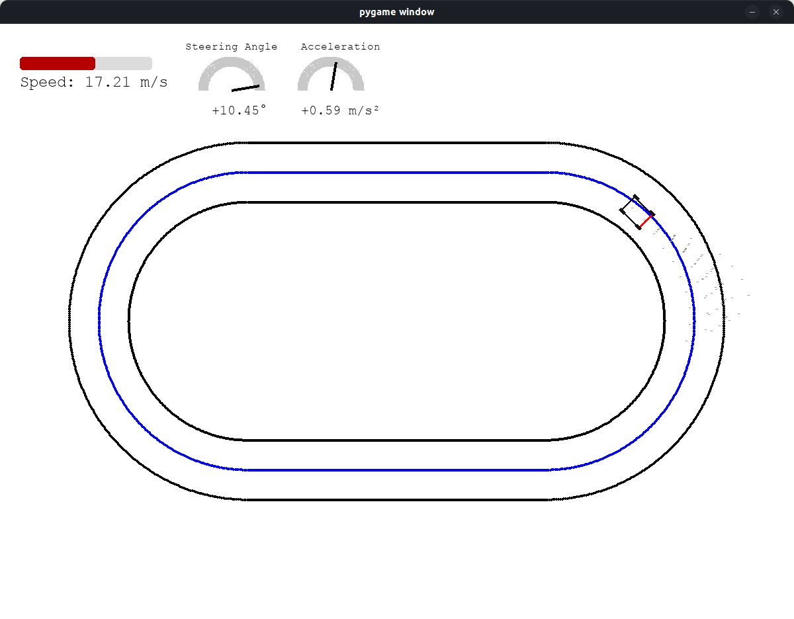

# Symulator samochodu (model kinematyczny) z sterowaniem MPPI

## Opis projektu

Projekt przedstawia **symulację pojazdu poruszającego się po zadanym torze**, zbudowaną na bazie modelu kinematycznego, sterowania predykcyjnego (MPPI) oraz graficznej wizualizacji w środowisku Pygame.  
Kod jest modularny i podzielony na czytelne komponenty: model pojazdu, kontroler, logikę główną i warstwę wizualizacji.

---

## Zawartość projektu

- **Model kinematyczny pojazdu** z ograniczeniami fizycznymi (max. prędkość, skręt, przyspieszenie)
- **Sterownik MPPI (Model Predictive Path Integral)** optymalizujący sterowania na bazie kosztów trajektorii
- **Graficzna wizualizacja pojazdu** i toru jazdy w Pygame, wraz z wskaźnikami (prędkość, skręt, przyspieszenie)
- **Odczyt toru jazdy z pliku CSV** oraz automatyczne inicjowanie pojazdu na trasie
- **Czytelna separacja logiki** – każdy element (model, sterownik, wizualizacja, logika aplikacji) znajduje się w osobnym pliku
- **Foldery docs** – notatki

---

## Struktura katalogów i plików

```
.
├── main.py                                # Główna pętla symulacji, połączenie wszystkich komponentów
├── vehicle_kinematic_model.py             # Model kinematyczny pojazdu (obliczenia fizyczne)
├── vehicle_sprite.py                      # Graficzna reprezentacja pojazdu i jego aktualizacja w Pygame
├── mppi_controller.py                     # Implementacja sterownika MPPI (sterowanie predykcyjne)
├── graphics_utils.py                      # Moduł z funkcjami do rysowania elementów podczas symulacji
├── docs_theory/                           # 📘 Czysta teoria, wzory, algorytmy
│   ├── article_nonlinear_systems_mppi.md
│   └── general_info_mppi.md
|
├── docs_project/                          # 🛠️ Notatki związane z implementacją
│   ├── kinematic_model_description.md
│   └── mppi_controller_description.md
|
├── track_data/
│   └── ovalpath.csv                       # Przykładowy tor jazdy w postaci punktów, środkowa linia toru
|
├── [inne pliki pomocnicze]
└── .gitignore                             # Ignorowane pliki (np. .vscode, __pycache__)

```

---

## Opis plików programu

### `vehicle_kinematic_model.py`
Zawiera klasę **VehicleKinematicModel** implementującą model kinematyczny pojazdu (rowerowego).  
Pozwala na:
- Obliczanie nowego stanu pojazdu na podstawie sterowania (skręt, przyspieszenie)
- Uwzględnienie fizycznych ograniczeń pojazdu (max. prędkość, max. skręt itd.)

### `vehicle_sprite.py`
Klasa **VehicleSprite** dziedzicząca po modelu kinematycznym, łączy symulację fizyczną z graficzną reprezentacją pojazdu w Pygame.
- Rysuje korpus pojazdu, koła, orientację
- Synchronizuje aktualny stan pojazdu z wizualizacją

### `mppi_controller.py`
Zawiera implementację **sterownika Model Predictive Path Integral (MPPI)**.
- Symuluje wiele trajektorii z różnymi sterowaniami, wybiera najlepsze na podstawie kosztu
- Koszt uwzględnia m.in. progres wzdłuż toru, wyjazd poza tor, kary za zły kierunek, szybkość i zakręty
- Pozwala dynamicznie optymalizować sterowanie pojazdem względem docelowej trasy

### `main.py`
Główna pętla symulacji, która:
- Ładuje tor z pliku CSV (`track_data/ovalpath.csv`)
- Inicjalizuje pojazd i kontroler
- Rysuje tor, trajektorie, wskaźniki (prędkościomierz, skręt, przyspieszenie)
- Obsługuje interakcje i aktualizuje symulację w czasie rzeczywistym

### `graphics_utils.py`
Zawiera zestaw funkcji do rysowania elementów graficznych na ekranie:
- tory, trajektorie, wskaźniki (prędkość, kierunek, przyspieszenie)
- pomocnicze funkcje wizualizacji stanu symulacji

---

## 🚀 Sposób uruchomienia

1. **Sklonuj repozytorium:**

   ```bash
   git clone https://github.com/Mateo755/MPPI_Motion_Controller
   cd MPPI_Motion_Controller
   ```

2. **Utwórz i aktywuj środowisko wirtualne (zalecane):**

   ```bash
   python -m venv venv
   source venv/bin/activate        # dla systemu Linux/macOS
   .\venv\Scripts\activate         # dla systemu Windows
   ```

3. **Zainstaluj zależności:**

   ```bash
   pip install pygame numpy
   ```

4. **Umieść plik toru jazdy w katalogu `track_data/`**

   - Przykład: `track_data/ovalpath.csv`
   - Plik powinien zawierać nagłówek `x,y` oraz listę punktów reprezentujących środek toru.
   - Upewnij się w kodzie, że ścieżka do pliku toru jest poprawna i odpowiada rzeczywistej nazwie

5. **Uruchom symulację:**

   ```bash
   python main.py
   ```



---

## Dalszy rozwój

Projekt stanowi punkt wyjścia do eksperymentów z:
- bardziej zaawansowanymi modelami pojazdów
- innymi algorytmami sterowania (MPC, RL, PID itd.)
- generowaniem i analizą różnych torów jazdy

---

