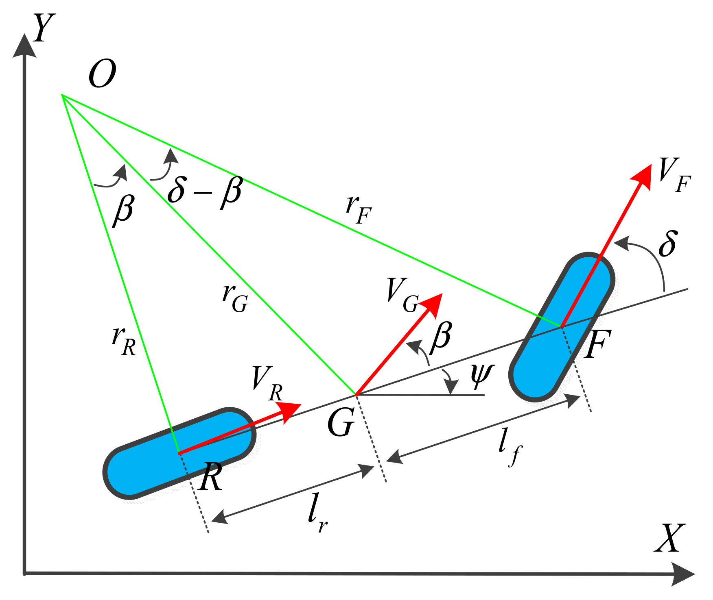

# Model kinematyczny pojazdu – opracowanie i implementacja

## Wprowadzenie

Niniejszy dokument stanowi opracowanie modelu kinematycznego pojazdu, implementowanego w ramach projektu symulacyjnego. Model opiera się na tzw. **modelu rowerowym (bicycle model)**, który stanowi szeroko akceptowane uproszczenie w robotyce mobilnej oraz systemach planowania ruchu. Zakłada on sztywne połączenie przedniej i tylnej osi pojazdu, eliminując zjawiska poślizgu oraz uwzględniając tylko istotne stopnie swobody w płaszczyźnie 2D.

---

## Opis przestrzeni stanu

Stan pojazdu reprezentowany jest czterowymiarowym wektorem:

```
state = [x, y, yaw, v]
```

gdzie:
- `x`, `y` – współrzędne położenia geometrycznego środka masy pojazdu w układzie globalnym [m],
- `yaw` – kąt orientacji pojazdu względem osi X układu globalnego [rad],
- `v` – prędkość liniowa pojazdu w kierunku jego osi podłużnej [m/s].

---

## Wektor sterowania

Sterowanie pojazdem opisane jest jako wektor wejściowy:

```
control = [steer, accel]
```

gdzie:
- `steer` – kąt skrętu przednich kół względem osi pojazdu [rad],
- `accel` – przyspieszenie liniowe pojazdu [m/s²].

---

## Model matematyczny – równania kinematyczne

Ewolucja stanu pojazdu opisana jest układem równań różniczkowych pierwszego rzędu, które definiują dynamikę ruchu w czasie dyskretnym:

```
dx   = v * cos(yaw)
dy   = v * sin(yaw)
dyaw = v / wheel_base * tan(steer)
dv   = accel
```

Zaktualizowany stan pojazdu po czasie `dt` obliczany jest zgodnie z równaniem Eulera:

```
x    += dx * dt
y    += dy * dt
yaw  += dyaw * dt
v    += dv * dt
```

---

## Parametry fizyczne modelu

Implementacja modelu zakłada istnienie następujących parametrów geometryczno-fizycznych:

- `lF`, `lR` – odległości od środka masy do osi przedniej i tylnej [m],
- `wheel_base = lF + lR` – rozstaw osi pojazdu [m],
- `max_steer_abs` – maksymalny dopuszczalny kąt skrętu kół [rad],
- `max_accel_abs` – ograniczenie na wartość przyspieszenia [m/s²],
- `max_velocity` – dopuszczalna prędkość maksymalna pojazdu [m/s].

Parametry te uwzględnione są w pliku `vehicle_kinematic_model.py`.

---

## Implementacja programistyczna

Model został zaimplementowany jako klasa `VehicleKinematicModel`, której główną metodą jest:

```python
def next_state(self, x, u, dt):
```

Parametry metody:
- `x` – aktualny stan pojazdu `[x, y, yaw, v]`,
- `u` – wektor sterowań `[steer, accel]`,
- `dt` – krok symulacji [s].

Metoda zwraca stan pojazdu po czasie `dt`, zgodnie z opisanym modelem kinematycznym.

---

## Uwagi końcowe

Model kinematyczny, choć uproszczony, stanowi solidną bazę do projektowania i testowania algorytmów sterowania. W warunkach niskich prędkości oraz braku znacznych sił bocznych, jego dokładność jest wystarczająca dla celów symulacyjnych oraz wstępnego prototypowania układów regulacji trajektorii pojazdu.

---
---

## Interpretacja geometryczna – schemat modelu rowerowego

Poniższy schemat ilustruje kluczowe zależności geometryczne w modelu rowerowym. Model ten upraszcza rzeczywisty układ kół, zastępując oś przednią i tylną pojedynczymi punktami kontaktu z nawierzchnią.



**Tabela symboli:**

| Symbol  | Znaczenie                                               |
|---------|----------------------------------------------------------|
| `G`     | Środek masy pojazdu (centre of gravity)                 |
| `O`     | Centrum zakrętu (toru jazdy)                             |
| `F`     | Punkt styku przedniego koła z nawierzchnią              |
| `R`     | Punkt styku tylnego koła z nawierzchnią                 |
| `VG`    | Prędkość środka masy pojazdu                            |
| `VR`    | Prędkość tylnego koła                                   |
| `VF`    | Prędkość przedniego koła                                |
| `δ`     | Kąt skrętu przedniego koła (steering angle)             |
| `β`     | Kąt poślizgu środka masy (slip angle)                   |
| `ψ`     | Kąt orientacji pojazdu (heading angle)                  |
| `ψ + β` | Kąt kursu pojazdu (course angle), rzeczywisty kierunek ruchu pojazdu                       |
| `lf`    | Odległość od środka masy do przedniej osi               |
| `lr`    | Odległość od środka masy do tylnej osi                  |
| `rF`    | Promień zakrętu do przedniego koła                      |
| `rG`    | Promień zakrętu do środka masy                          |
| `rR`    | Promień zakrętu do tylnego koła                         |

---
---

## Zakres wymaganych zmiennych w modelu kinematycznym

Nie wszystkie zmienne przedstawione na schemacie modelu rowerowego są niezbędne do implementacji podstawowego modelu kinematycznego. Poniżej zestawiono, które wielkości są kluczowe, a które mają jedynie znaczenie koncepcyjne lub analityczne.

### 🎯 Zmienne niezbędne do obliczeń

| Zmienna   | Uwzględniana? | Uzasadnienie |
|-----------|---------------|--------------|
| `x`, `y`  | ✅ Tak         | Pozycja geometryczna pojazdu w układzie globalnym |
| `ψ`       | ✅ Tak         | Orientacja pojazdu (kąt yaw) |
| `v`       | ✅ Tak         | Prędkość liniowa pojazdu |
| `δ`       | ✅ Tak         | Kąt skrętu przednich kół – podstawowy sygnał sterujący |
| `a`       | ✅ Tak         | Przyspieszenie liniowe |
| `lf`, `lr`| ✅ Tak         | Geometria pojazdu – wyznacza promień zakrętu i dynamikę obrotu |

### 🚫 Zmienne pomijane w uproszczonym modelu

| Zmienna   | Uwzględniana? | Uzasadnienie |
|-----------|---------------|--------------|
| `β`       | ❌ Nie         | Kąt poślizgu nie występuje – model zakłada brak poślizgu |
| `rF`, `rG`, `rR` | ❌ Nie | Promienie zakrętu – wykorzystywane w analizie, nie w obliczeniach |
| `VG`, `VF`, `VR` | ❌ Nie | Wektory prędkości – pośrednio wynikają z `v` i `ψ`, nie są niezależne |
| `ψ + β`   | ❌ Nie         | Kąt kursu pojazdu – istotny w dynamice, pomijany w kinematyce |
| `O`       | ❌ Nie         | Centrum krzywizny nie jest obliczane wprost w modelu |

### ✍️ Wnioski

Model kinematyczny wykorzystuje minimalny zestaw zmiennych pozwalający na realistyczną symulację ruchu pojazdu w 2D. Elementy takie jak kąty poślizgu, promienie krzywizny czy rzeczywiste kierunki ruchu są użyteczne w zaawansowanych modelach dynamicznych, ale nie są wymagane do celów planowania i podstawowego sterowania.