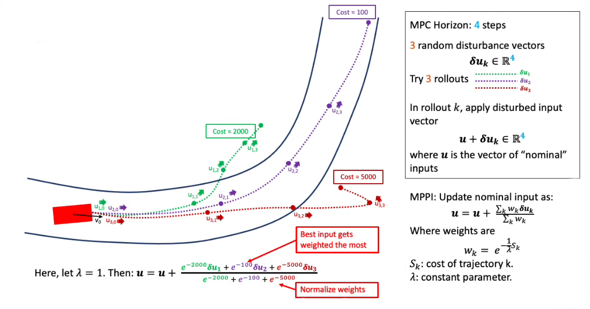

# Opis problemu: Sterowanie systemami nieliniowymi z zakłóceniami

## Równanie dynamiki systemu

System jest opisywany równaniem różniczkowym stochastycznym:

$$
dx = \big(f(x, t) + G(x, t)u(x, t)\big)dt + B(x, t)d\omega
$$

* $x$ – stan systemu
* $u(x, t)$ – sterowanie (wejście)
* $f(x, t)$ – nieliniowa funkcja dynamiki
* $G(x, t)$ – macierz wejściowa (wpływ sterowania)
* $B(x, t)d\omega$ – zakłócenie procesowe (szum, np. modelowany jako proces Wienerowski)

System jest nieliniowy i zawiera zakłócenia (ang. *process noise*).

---

## Schemat blokowy

* **System z zakłóceniami** generuje stan $x_k$.

* **Sensor** obserwuje stan, ale zwraca tylko szacowaną wartość z zakłóceniem pomiarowym:
  $z_k + \zeta_k$
  gdzie $\zeta_k$ to szum pomiarowy.

* Pomiar trafia do **kontrolera**, który:

  * Oblicza sterowanie $u_k$
  * Używa funkcji kosztu (ang. *cost function*), by zoptymalizować decyzje.

* Sterowanie $u_k$ jest następnie podawane do systemu.

---

## 🔁 Reguła aktualizacji sterowania (Update Law)

Zaktualizowane sterowanie w danym stanie i czasie obliczane jest zgodnie z poniższym wzorem:

$$
\mathbf{u}(x_t, t)^* = \mathbf{u}(x_t, t) + \frac{\mathbb{E}_q\left[\exp\left(-\frac{1}{\lambda} \tilde{S}(\tau)\right) \delta \mathbf{u}\right]}{\mathbb{E}_q\left[\exp\left(-\frac{1}{\lambda} \tilde{S}(\tau)\right)\right]}
$$

gdzie:

-  $\mathbf{u}(x_t, t)$  — bieżące (nominalne) sterowanie,
- $ \delta \mathbf{u}$  — perturbacja sterowania,
- $\tilde{S}(\tau)$  — skumulowany koszt trajektorii \( \tau \),
- $\lambda $ — parametr temperatury (kontroluje stopień eksploracji),
- $\mathbb{E}_q[\cdot]$  — wartość oczekiwana względem rozkładu trajektorii.

Ostateczne sterowanie stanowi sumę nominalnego wejścia i średniej ważonej perturbacji, gdzie wagi są funkcją (malejącą) kosztu trajektorii.


---

## Cel

Zaprojektować **efektywny kontroler** dla systemu nieliniowego w obecności **szumu procesowego i zakłóceń pomiarowych**, wykorzystując **zaawansowaną teorię sterowania stochastycznego**, np. path integral control.

---

# MPPI – Kluczowa idea algorytmu (wizualizacja)

## 🔍 Opis ogólny

**Model Predictive Path Integral (MPPI)**, należy do klasy sterowania predykcyjnego (MPC), ale oparty jest na podejściu stochastycznym (*sampling-based*).

### ♻ Główne kroki algorytmu:

1. **Symulacja przyszłości** – tworzonych jest wiele tzw. *rolloutów*, czyli trajektorii.
2. **Losowe zakłócenia wejść** – każda trajektoria ma nieco inne sterowanie: `u + delta_u_k`.
3. **Ocena trajektorii** – każda trajektoria otrzymuje koszt `S_k` (im niższy, tym lepiej).
4. **Wyznaczenie najlepszego wejścia** – nowe sterowanie obliczane jest jako ważona suma perturbacji `delta_u_k`, gdzie wagi `w_k` zależą od kosztu `S_k`.

---

## Szczegóły matematyczne

### Uaktualnianie wejścia

Formuła aktualizacji sterowania:

```
u = u + sum(w_k * delta_u_k) / sum(w_k)
```

gdzie:

* `delta_u_k` – zakłócenie sterowania w rollout'cie `k`,
* `w_k = exp(-S_k / lambda)` – waga zależna od kosztu,
* `lambda` – parametr eksploracji (temperatura),
* `S_k` – koszt trajektorii `k`.

---

## Interpretacja wizualna



* Na wykresie przedstawiono 3 trajektorie (`delta_u_1`, `delta_u_2`, `delta_u_3`) w różnych kolorach.
* Każda ma przypisany **koszt**: 100, 2000, 5000.
* Im **niższy koszt**, tym **większa waga perturbacji** i **większy wpływ na wynikowe sterowanie**.

---

## 📌 Kluczowe pojęcia z diagramu

| Symbol / hasło    | Znaczenie                               |
| ----------------- | --------------------------------------- |
| `u`               | Nominalne (bieżące) sterowanie          |
| `delta_u_k`       | Zakłócenie sterowania w rollout'cie `k` |
| `S_k`             | Koszt trajektorii rollout'u `k`         |
| `w_k`             | Waga perturbacji                        |
| `lambda`          | Parametr eksploracji (temperatura)      |
| Normalize weights | Normalizacja wag do sumy ≈ 1            |

---

## ⚙️ Schemat algorytmu MPPI (pseudo-kod)

```
Initialize control sequence u_0..u_{N-1}
while task not completed do:
    Generate random perturbations δu
    for Monte Carlo rollouts k = 1..K do:
        start in current state x_k = x(t_0)
        for MPC horizon steps n = 0..N-1 do:
            Input u_{k,n} = u_n + δu_{k,n}
            Next state x_{k,n+1} = model(x_{k,n}, u_{k,n})
            Rollout cost S_k += stage cost q_{k,n}
        end
    end
    for n = 0..N-1 do:
        u_n += reward-weighted perturbations
    end
    Apply first input u_0
    Get system feedback
    Check if task completed
end

```

## 📊 Kluczowe kroki algorytmu MPPI z wyróżnieniem

1. **Inicjalizacja sterowania:**
   `u_0..N-1` – inicjalna sekwencja sterowania (np. zerowa lub nominalna).

2. **Główna pętla sterowania:**
   `while task not completed:` – wykonuj pętlę, aż zadanie zostanie zakończone.

3. **Losowanie perturbacji sterowania:**
   `Generate random perturbations δu` – losowe odchylenia wejść dla prób Monte Carlo.

4. **Symulacja trajektorii (Monte Carlo rollouts):**
   `for k = 1..K:` – wykonaj **K rolloutów**, czyli symulowanych przebiegów przyszłości.
   `x_k = x(t0)` – każdy rollout startuje ze stanu początkowego.

5. **Symulacja w horyzoncie predykcji (MPC horizon):**
   `for n = 0..N-1:`
       `u_k,n = u_n + δu_k,n` – **dodanie perturbacji do nominalnego sterowania**.
       `x_k,n+1 = model(x_k,n, u_k,n)` – **symulacja nowego stanu** na podstawie modelu.
       `S_k += stage cost q_k,n` – **sumowanie kosztu etapu** dla trajektorii.

6. **Aktualizacja sterowania:**
   `u_n += reward-weighted perturbations`
   → 🔥 **To najważniejszy krok!** Aktualizacja wejścia na podstawie trajektorii, które miały najmniejsze koszty.

7. **Zastosowanie pierwszego sterowania:**
   `Apply first input u_0` – wyślij pierwsze sterowanie do systemu.

8. **Sprzężenie zwrotne:**
   `Get system feedback` – pobierz nowe dane z sensora/systemu.

9. **Sprawdzenie warunku zakończenia:**
   `Check if task completed`

## 🔗 Źródło

Wzory oraz koncepcje pochodzą z wykładu gdzie zaprezentowany został sposób implementacji MPPI: [MPPI Lecture on YouTube](https://www.youtube.com/watch?v=19QLyMuQ_BE&t=1107s)